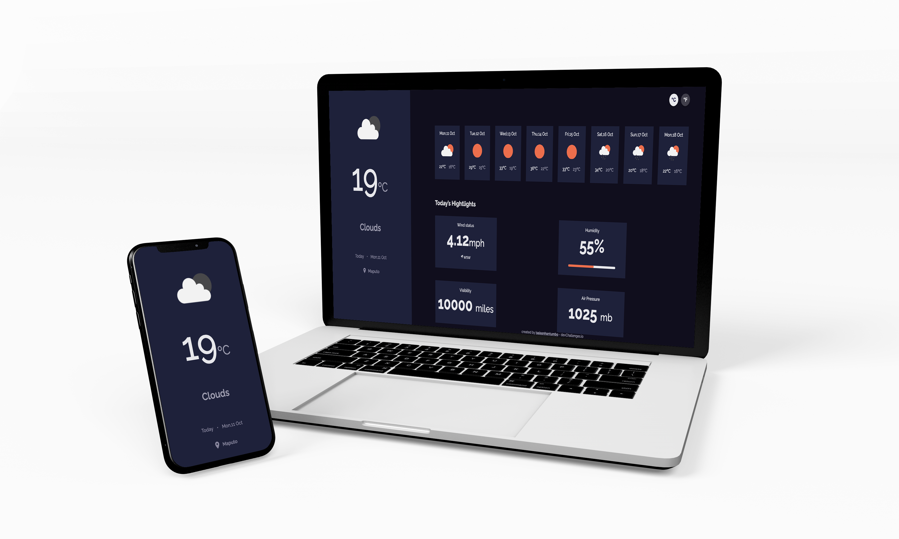

<br/>
<h1 align="center">
  
</h1>
<h2 align="center"> 


</h2>
<br>
<p align="center">
<a href="#-tecnologias-usadas">Tecnologias usadas</a>&nbsp;&nbsp;&nbsp;|&nbsp;&nbsp;&nbsp;
<a href="#-desafios-do-projecto">Desafios do projecto</a>&nbsp;&nbsp;&nbsp;|&nbsp;&nbsp;&nbsp;
<a href="#-pré-requisitos">Pré-requisitos</a>&nbsp;&nbsp;&nbsp;|&nbsp;&nbsp;&nbsp;
<a href="#-como-rodar-o-projecto">Como rodar o projecto</a>
</p>
<p align="center">
     
</p>

<p align="center">
O <span>Weather-app</span> é aplicativo de previsão de tempo que permite que o usuario veja a previsão do tempo da sua localização actual.
</p>


<!-- <h1 align="center"> 

<a href="https://exweather-app.vercel.app">Acessar demonstração</a>
</h1> -->


## 🛠 Tecnologias usadas

As seguintes ferramentas foram usadas na construção do projeto:


- ReactJs
- Typescript
- Styled-components
- React-icons
- Axios
- Date-fns
- OpenWeather API
- Ipstack API


---

## ⛈  Desafios do projecto
  Desafio: Criar um aplicativo de clima usando uma API. Use bibliotecas de front-end como React ou Vue. Não olhe para a solução existente. Preencher histórias de usuários abaixo:

- [x] História do usuário: posso ver o clima da cidade como padrão, de preferência minha localização atual

- [ ] História do usuário: posso pesquisar por cidade

- [x] História do usuário: posso ver o clima de hoje e dos próximos 5 dias

- [x] História do usuário: posso ver a data e a localização do clima

- [x] História do usuário: posso ver de acordo com a imagem para cada tipo de clima

- [x] História do usuário: posso ver o grau mínimo e máximo a cada dia

- [x] História do usuário: posso ver o status e a direção do vento

- [x] História do usuário: Eu posso ver a percentagem de humidade

- [x] História do usuário: posso ver um indicador de visibilidade

- [x] História do usuário: posso ver o número da pressão do ar

Desafio do site [DevChallenges.io](https://devchallenges.io/challenges/mM1UIenRhK808W8qmLWv)


---

## ⚠ Pré-requisitos

Antes de começar, você vai precisar ter instalado em sua máquina as seguintes ferramentas:
[Git](https://git-scm.com), [Node.js](https://nodejs.org/en/). 
Além disto é bom ter um editor para trabalhar com o código como [VSCode](https://code.visualstudio.com/)

---
## 🎲 Como rodar o projecto

```bash
# Clone este repositório
$ git clone <https://github.com/isaiasnhantumbo/weather-app.git>

# Acesse a pasta do projeto no terminal/cmd
$ cd weather-app

# Abra a pasta no Visual Studio Code
$ code .

# Instale as dependência
$ yarn

# Execute o servidor aplicação com o yarn
$ yarn server

# Execute a aplicação com o yarn
$ yarn dev

# O servidor inciará na porta:3000 - acesse <http://localhost:3000>
```

---


## 📘 Licença
Este projecto usa a  [MIT License](LICENSE).
****
<h1 align="center">
👨🏽‍🏫 
<br>
Desenvolvido por
<br>
 Isaias Nhantumbo Junior
</h1>
</p>
<h1 align="center"> 🤝 &nbsp;Vamos nos conectar ?👨 </h1>

<p align="center">
<a href="https://www.youtube.com/channel/UCOyeYkH0MwJ6RrXTcEFFdAQ?view_as=subscriber"></a>
<a href="https://www.linkedin.com/in/isaias-nhantumbo-junior-733bb619b/"></a>
<a href="https://www.instagram.com/isaias_nhantumbo/"></a>
</p>


